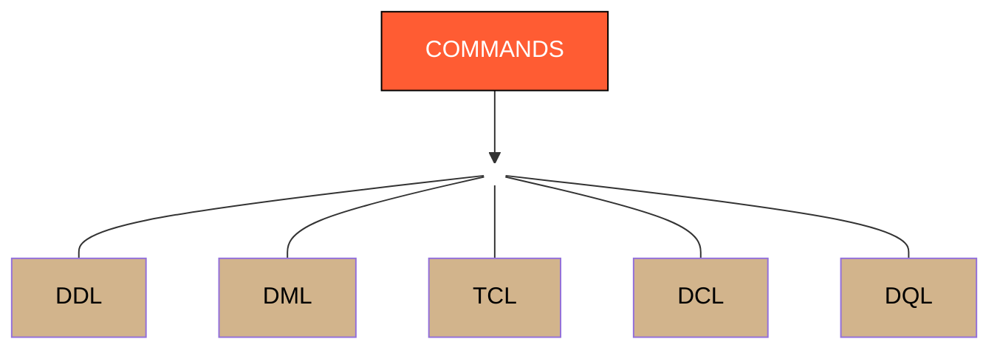

# 5 Types Commands in SQL

## SQL Command Types

- **DDL** → Data Definition Language  
  Example: `CREATE`, `ALTER`, `DROP`

- **DML** → Data Manipulation Language  
  Example: `INSERT`, `UPDATE`, `DELETE`

- **TCL** → Transaction Control Language  
  Example: `COMMIT`, `ROLLBACK`

- **DCL** → Data Control Language  
  Example: `GRANT`, `REVOKE`

- **DQL** → Data Query Language  
  Example: `SELECT`
