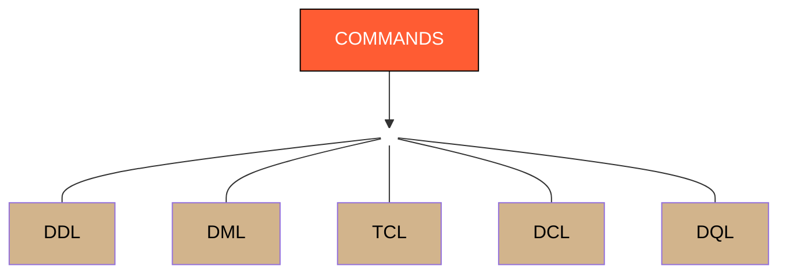

# 5 Types Commands in SQL

  ## SQL Command Types

### 1. DDL (Data Definition Language)
DDL commands are used to **define, modify, and remove the structure of database objects** such as tables, schemas, indexes, and databases.

**Common Commands:**
- `CREATE` → Creates a new table, database, or object
- `ALTER` → Modifies the structure of an existing table
- `DROP` → Deletes a table or database permanently
- `TRUNCATE` → Removes all records from a table without deleting the table structure

---

### 2. DML (Data Manipulation Language)
DML commands are used to **manipulate the data stored inside database tables**.

**Common Commands:**
- `INSERT` → Adds new records into a table
- `UPDATE` → Modifies existing records
- `DELETE` → Removes specific records from a table

---

### 3. TCL (Transaction Control Language)
TCL commands are used to **manage transactions in the database**, ensuring data consistency and control over changes.

**Common Commands:**
- `COMMIT` → Saves all changes permanently
- `ROLLBACK` → Undoes changes made in the current transaction
- `SAVEPOINT` → Creates a point to which a transaction can be rolled back

---

### 4. DCL (Data Control Language)
DCL commands are used to **control access and permissions** for database users.

**Common Commands:**
- `GRANT` → Gives privileges to users
- `REVOKE` → Removes privileges from users

---

### 5. DQL (Data Query Language)
DQL commands are used to **retrieve data from the database**.

**Common Commands:**
- `SELECT` → Fetches data from one or more tables

## SQL vs NoSQL Databases

| Aspect | SQL Databases | NoSQL Databases |
|---|---|---|
| **Data Model** | Relational (table-based) | Non-relational (document, key-value, graph, column-based) |
| **Structure** | Structured data stored in rows and columns | Unstructured or semi-structured data |
| **Schema** | Fixed schema (predefined structure) | Flexible schema (dynamic structure) |
| **Query Language** | Uses SQL for querying data | Uses various query methods (e.g., JSON-like queries) |
| **Scalability** | Vertically scalable (add more resources to one server) | Horizontally scalable (add more servers/nodes) |
| **ACID Compliance** | Strong ACID compliance (Atomicity, Consistency, Isolation, Durability) | Eventual consistency (some NoSQL databases support ACID) |
| **Use Cases** | Suitable for complex queries and transactional data | Ideal for large-scale data, real-time analytics, and big data |
| **Examples** | PostgreSQL, MySQL, Oracle, SQL Server | MongoDB, Cassandra, Redis, Couchbase |
| **Performance** | Optimized for structured data and complex queries | Optimized for large volumes of data and fast reads/writes |
| **Relationships** | Supports relationships between tables (foreign keys) | Stores data without predefined relationships |
| **Data Integrity** | Ensures high data integrity and consistency | Prioritizes scalability and speed over strict consistency |
| **Transactions** | Supports multi-row transactions | Limited or no support for multi-document transactions |
