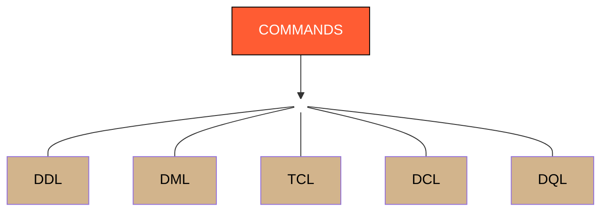

# 5 Types Commands in SQL

  ## SQL Command Types

- **DDL (Data Definition Language)**  
  Used to **define and manage the structure** of the database, such as creating, modifying, or deleting tables and other database objects.  
  **Examples:** `CREATE`, `ALTER`, `DROP`, `TRUNCATE`

- **DML (Data Manipulation Language)**  
  Used to **insert, update, and delete data** stored inside database tables.  
  **Examples:** `INSERT`, `UPDATE`, `DELETE`

- **TCL (Transaction Control Language)**  
  Used to **manage transactions** in the database, allowing changes to be saved or undone.  
  **Examples:** `COMMIT`, `ROLLBACK`, `SAVEPOINT`

- **DCL (Data Control Language)**  
  Used to **control user access and permissions** in the database.  
  **Examples:** `GRANT`, `REVOKE`

- **DQL (Data Query Language)**  
  Used to **retrieve data** from the database.  
  **Examples:** `SELECT`
